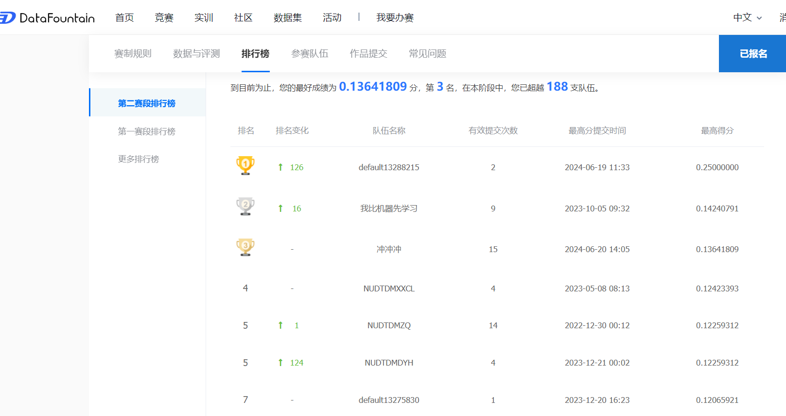

## 目录介绍
- configs: 配置文件
- data: 预处理后的数据和结果文件
- imgs: 绘制的训练图像
- logging: 日志文件
- model: 模型权重文件
- notebook: 演示文件
- src: 代码部分

## 运行方式
确认具有环境依赖后，运行 notebook 下的 SN_demo.ipynb 或 SN_pair_demo.ipynb 即可。
前者和后者对应不同的训练方式，前者是自监督学习头部直接输出类概率，后者则输出高维表示并和项目嵌入做内积来产生预测概率。

## 超参数调整
在 configs 中新建文件并键入自己的超参数设置，然后在 jupyter 文件中的第3个代码单元格修改配置文件的导入路径即可。所有的默认超参数见 src/config/defaults.py。

## 主要思路介绍
使用了三种模型：GRU4Rec 、 SAS4Rec 和 NextItItem。
尝试了两种训练方式：一是最后一层直接输出每个 item 的类概率，二是最后一层得到隐藏表示，再和项目嵌入做内积，将内积的数值大小作为类概率。

## 我们的结果
截至2024年6月20日。我们在CCF图书推荐系统比赛中取得了排行榜第3名的好成绩。使用的超参数配置为 DROP_1.yaml，结果文件为 drop_submission_1.csv。

## 备注
- data/train.pt 文件由于过大而仅上传了压缩文件，请自行解压 data/train.zip 得到 train.pt。
- 2024年春季学期参与同场比赛的队伍请慎重照搬我们的代码。
